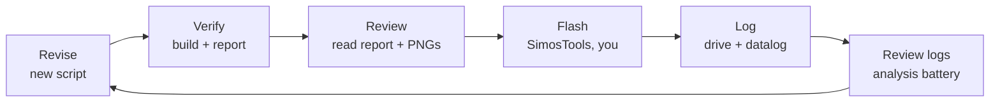

# simoscal — beta tester guide

Welcome, and thanks for trying this. You're here because you tune Simos18 cars
and you're willing to point a young tool at a real engine. This guide gets you
from zero to a verified bin, and tells you honestly where the tool stops.

> **Draft status.** Two things this guide describes are not built yet:
> the `python -m simoscal.preflight` command (§3) and the validated-profile
> model for other box codes (§6). Both are in the beta plan. Everything else —
> install, the tune API, the analysis battery — works today. This note comes out
> when they land.

---

## 1. What this is, and what it will not do

`simoscal` is a Python library that edits Simos18 calibrations from code instead
of from a GUI. You point it at an XDF and a bin, change table values **in real
physical units**, and it writes a new bin where only the bytes you meant to
change are different — checksums verified, every edit journaled.

The payoff is traceability. Every change is a line of code you can read, diff,
and re-run. No "what did I change three weeks ago?"

Two things it will never do, on purpose:

1. **It never flashes.** A revision produces a `.bin` file. You flash it
   yourself with SimosTools, after reading the report.
2. **It never silently fixes anything.** If a value looks wrong or a checksum is
   stale, it fails loudly rather than quietly clamping or correcting. When it
   refuses to do something, that is the feature working.

It also does not teach tuning. Whether 26 psi on your turbo on your fuel is a
good idea is your judgment. This library's job is to make sure the number you
decided on is the number that reaches the ECU, and that you can prove it
afterwards.

---

## 2. Three things to read before you touch anything

### My car is not your car

This repo, and the companion `gti-tune` repo, contain a complete worked tuning
lineage — R00 through R15, with a revision log that explains every change and
why. It is there so you can see what good practice looks like.

**It is not a recipe book.** Those numbers target one specific car: a 2017 GTI
with an IS20 turbo, an upgraded intercooler, running 92 octane between sea level
and 6000 ft. Boost targets, timing, and the wastegate feedforward are all shaped
around that hardware and that fuel.

Copy a boost target from R15 onto a car with a stock intercooler, different
fuel, or a different turbo, and you have not borrowed a tune — you have borrowed
someone else's assumptions about hardware you don't have. Read the lineage for
*method*. Derive your own numbers.

### Use your own bin

The repo ships a stock bin at `bin/5G0906259L__0002.bin`, and the examples in
[`authoring-a-revision.md`](authoring-a-revision.md) use it, because they were
written for the car it came off.

**Read your own bin off your own car and build from that.** Even on the same box
code, build from the file your ECU actually has. Never flash a bin derived from
a stock image that did not come from your car.

Keep your own stock read somewhere safe and never edit it. That file is your
recovery image, and the day you need it you will really need it.

### Nothing here is a substitute for knowing the stakes

A wrong byte can brick the ECU. A wrong number can mean overboost, lean lambda,
or knock — and knock is how pistons die. The library's correctness guarantees
are safety mechanisms, not conveniences.

---

## 3. Is your car supported?

Answer this before you invest any time. **Most people who find this tool will
get "not yet"**, and it's better to know in two minutes than in two hours.

`simoscal` was built around the SC8S50 file structure and box code
`5G0906259L_0002`. Support for anything else means writing a *profile* — see §6.

Once you've done the setup in §4, run:

```bash
./.venv/bin/python -m simoscal.preflight /path/to/your.bin /path/to/your.xdf
```

You get one of four verdicts:

| Verdict                 | What it means                                                         | What you do                        |
|-------------------------|-----------------------------------------------------------------------|------------------------------------|
| `READY`                 | Recognised profile, all tables resolved, checksums verify clean       | Full beta — go to §5               |
| `READY_STALE_CHECKSUM`  | Same, but a checksum is stale and correctable — normal for an edited bin | Full beta — the build step fixes it |
| `INSPECT_ONLY`          | The bin and XDF parse fine, but no validated profile matches this calibration | Read and explore — see §6      |
| `BLOCKED`               | Unusable: truncated, unparseable, out-of-region, or a CAL-only slice  | Stop — check you have a full 4 MiB read |

`INSPECT_ONLY` is a deliberate refusal, not a limitation we forgot to lift. The
tool will not write a bin whose tables it cannot fully resolve, because a 4×6
boost setpoint and an 8×12 boost setpoint are not the same table no matter what
they're called. Writing to a table it has misidentified is exactly the failure
mode that ends with a dead engine.

---

## 4. Setup

Requires Python 3.11 or newer.

```bash
git clone https://github.com/SamRyeIn/simoscal.git
cd simoscal
python -m venv .venv
./.venv/bin/pip install -e ".[dev]"
```

Check it works:

```bash
./.venv/bin/python -m pytest tests -q
```

That should pass clean. If it doesn't, that's a bug report — see §8.

**Optional, and recommended:** clone the companion `gti-tune` repo for the
worked lineage, the knowledge notes, and real datalogs with written reviews.
It's a reference, not a dependency — `simoscal` works without it.

```bash
git clone https://github.com/SamRyeIn/gti-tune.git
```

---

## 5. Your first revision

A **revision** is one Python script that declares an entire calibration and
builds one bin. Revisions are numbered and never edited in place: to make R02,
copy R01, change the numbers, run it.

The full walkthrough is **[`authoring-a-revision.md`](authoring-a-revision.md)**
— start there, it assumes you know Simos18 tuning and have never seen this
library. The shape, so you know what you're getting into:

```python
tune = Tune.open(SC8S50, xdf=XDF_PATH, bin=MY_OWN_STOCK_BIN)

tune.boost.put_ceiling_psi(
    22.0,
    intent="raise the full-load boost target for the upgraded intercooler",
)

result = build(tune, "R01", out_root=OUT_ROOT, reference_bin=PREVIOUS_BIN)
```

Three things worth knowing before you read the full guide:

- **`intent=` is required on every calibration-changing call.** It becomes the
  "Why" column in the report, and in six months it is the only record of why a
  number is what it is.
- **Always pass `reference_bin=`.** `build()` runs every verification gate —
  checksums corrected and independently verified, every journaled table read
  back off the saved file — but the byte-level audit only runs if you pass this.
  That audit is what turns an undeclared change into a failed build instead of a
  surprise. It's optional in the signature, and omitting it merely notes the
  skip in the report, so it is easy to lose without noticing. On your *first*
  revision there's no previous revision to compare against — pass **your own
  stock bin**, the same file you opened. Every revision after that, pass the
  previous revision's output.
- **Read the report before you flash.** Every run writes `report.md` and
  before/after PNGs of every changed table into a timestamped folder. Looking at
  those is the human review gate, and it is not optional.

---

## 6. If you got `INSPECT_ONLY`: the porting path

Your bin parses, your XDF parses, but no validated profile describes your
calibration. You can read and explore; you cannot write yet.

A **profile** is one module mapping logical names to the symbols in a particular
XDF, with each table's shape and units declared. Everything else in the library
speaks logical names, so adding a box code is writing one module — nothing else
has to change. Look at `simoscal/tune/profiles/sc8s50.py` to see one.

Shapes are declared so that resolving against a different XDF **fails loud** if
a same-named symbol has different geometry there. That check is the whole
safety argument for porting, so it doesn't get relaxed.

How a new profile earns write access — the graduated model, currently being
built:

1. You write a profile module for your XDF.
2. It must resolve cleanly against your bin — every declared table found, every
   shape matching.
3. Your stock bin must round-trip: open it, save with no edits, and the output
   is byte-identical to the input with checksums clean.
4. **A maintainer reviews it and marks it validated.** Only then does it become
   writable.

Step 4 is not gatekeeping for its own sake. A profile that has misidentified one
table is indistinguishable from a correct one right up until it writes to your
engine, and the person best placed to catch that is not the person who just
wrote it. You cannot self-certify write access to your own engine.

If you want to attempt a port, open an issue first and say which XDF and box
code — no point in two people writing the same profile.

---

## 7. The loop

Nothing is ever "done" from the bin alone. Only logs validate a tune.



For step 6, drop your CSVs in a folder and run:

```bash
./.venv/bin/python -m simoscal.analysis /path/to/your/log/folder
```

It writes `analysis_findings.md`, `analysis_findings.json`, and evidence plots
into that folder — knock, boost tracking, lambda, fuel pressure, turbo temps —
with an explicit list of checks it skipped and why. To see what it checks
without running anything: `--print-battery`.

The battery reports findings. It does not propose calibration changes, and it
never decides anything for you.

---

## 8. What to send back

This is a beta, and what makes it worth your time to us is:

**Bug reports.** Crashes, wrong values, checksum failures, and — genuinely —
error messages that confused you. A confusing error in a tool like this is a
safety bug. Include:

- The preflight verdict for your bin + XDF (copy the whole output).
- Your revision script, or the smallest snippet that reproduces it.
- The full traceback.
- Your Python version and OS.

**Never attach a tuned bin to an issue,** and never commit one. The `.gitignore`
already excludes `*.bin` — don't force-add.

**Datalogs.** Logs from cars that aren't the maintainer's are the single most
useful thing you can contribute — the analysis battery has only ever been tested
against one car. Send the raw CSVs plus **the PID list you logged with**, which
matters more than it sounds: gear indexing depends on it (see §9).

**Profile modules**, if you attempt a port. See §6 and §10.

---

## 9. House rules

- **Never flash a bin that hasn't passed review** — checksums verified, changed
  tables visually confirmed against the report and PNGs.
- **Never edit your stock bin.** It's the recovery image.
- **New work goes in a new revision script**, never by editing an old one. The
  point is that the history stays readable.
- **Always name tables by ID *and* plain-English description** — write
  `` `C_PRS_IM_SP_MAX` — Maximum requested intake-manifold pressure setpoint ``,
  not one or the other. IDs alone are unreadable; descriptions alone are
  ambiguous. This applies in code comments, commit messages, and issues.
- **Check gear indexing before you read a log.** The column header tells you
  which convention you have: `Gear ()` is zero-indexed, so the real gear is
  logged + 1. `Gear (gear)` is the actual gear. Get this wrong and you'll
  attribute a 3rd-gear pull to 2nd.
- **Trim to in-gear samples before quoting Calc HP or Calc TQ.** Those channels
  are gear-ratio-weighted, and the DSG's gear channel flips *before* the shift
  actually pulls the engine down — so the samples at the top of a pull that ends
  in an upshift read about 50 hp high. One measured example went 347 hp raw,
  298 hp trimmed. Drop the rows where the gear channel isn't the pull's gear.
- **The famous gotcha:** `C_M_AIR_CYL_SP_MAX` — Maximum allowed airmass setpoint
  — stores **kg/stroke** even though the XDF labels it mg/stroke. Writing `2000`
  there instead of `0.002` doesn't set a 2000 mg/stk limit, it raises the
  ceiling about 1.4 million-fold and effectively removes the limiter. The
  library gives you an mg/stk entry point (`tune.limits.airmass_cap_mg()`) so
  you never have to touch the raw value. Use it. This is the canonical example
  of why we double-check units against the ECU rather than the label.

---

## 10. Licence and contributions

`simoscal` is **GPL-3.0**, the same licence as
[SimosTools](https://github.com/Switchleg1/SimosTools). See
[`LICENSE`](../LICENSE).

Portions of `simoscal/checksum.py` adapt the Simos18 checksum and CRC work from
[VW_Flash](https://github.com/bri3d/VW_Flash) by Brian Ledbetter, used under
**BSD-2-Clause**. See [`LICENSE-THIRD-PARTY`](../LICENSE-THIRD-PARTY).

**What the licence does not cover.** The GPL grant applies to this project's own
source. It does **not** grant you rights to the OEM firmware image in `bin/`,
which is VW's copyright, nor to the community-authored XDF definitions in
`xdf/`, which aren't the maintainer's to relicense. They ship here for beta
convenience; treat their distribution as the beta's business, not yours.

**Contributing.** See [`CONTRIBUTING.md`](../CONTRIBUTING.md) before opening a
PR — it includes a short grant you'll be asked to acknowledge, which keeps
future licensing options open.

**No warranty.** GPL-3.0's disclaimer is not boilerplate here. This software
produces calibrations that go into real engines. You are responsible for what
you flash and what it does to your car.
